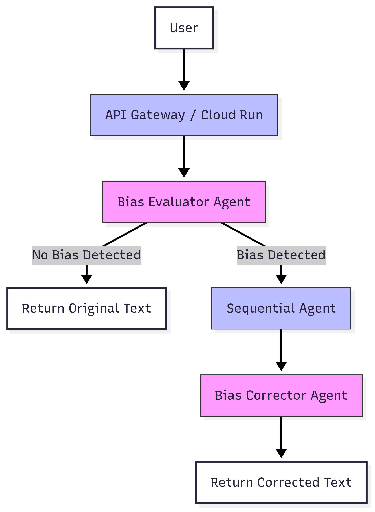

# Description of agent-jubdev

A base ReAct agent built with Google's Agent Development Kit (ADK)
Agent generated with [`googleCloudPlatform/agent-starter-pack`](https://github.com/GoogleCloudPlatform/agent-starter-pack) version `0.14.1`

## Problem Concept
Imagine an agent for content creators (bloggers, social media managers, even everyday users) that reviews their draft text (or description of an image/video) before publishing. It identifies potential ethical concerns like accidental bias, misinformation (by flagging questionable claims), privacy violations (e.g., inadvertently sharing sensitive info), or even tone issues that could be misinterpreted, and suggests ways to rephrase or mitigate these risks.


## Agent Process Diagram


## Project Structure

This project is organized as follows:

```
agent-jubdev/
├── app/                 # Core application code
│   ├── agent.py         # Main agent logic
│   ├── agent_engine_app.py # Agent Engine application logic
│   └── utils/           # Utility functions and helpers
├── .cloudbuild/         # CI/CD pipeline configurations for Google Cloud Build
├── deployment/          # Infrastructure and deployment scripts
├── notebooks/           # Jupyter notebooks for prototyping and evaluation
├── tests/               # Unit, integration, and load tests
├── Makefile             # Makefile for common commands
├── GEMINI.md            # AI-assisted development guide
└── pyproject.toml       # Project dependencies and configuration
```

## Requirements

Before you begin, ensure you have:
- **uv**: Python package manager (used for all dependency management in this project) - [Install](https://docs.astral.sh/uv/getting-started/installation/) ([add packages](https://docs.astral.sh/uv/concepts/dependencies/) with `uv add <package>`)
- **Google Cloud SDK**: For GCP services - [Install](https://cloud.google.com/sdk/docs/install)
- **Terraform**: For infrastructure deployment - [Install](https://developer.hashicorp.com/terraform/downloads)
- **make**: Build automation tool - [Install](https://www.gnu.org/software/make/) (pre-installed on most Unix-based systems)


## Quick Start (Local Testing)

Install required packages and launch the local development environment:

```bash
make install && make playground
```

## Commands

| Command              | Description                                                                                 |
| -------------------- | ------------------------------------------------------------------------------------------- |
| `make install`       | Install all required dependencies using uv                                                  |
| `make playground`    | Launch Streamlit interface for testing agent locally and remotely |
| `make backend`       | Deploy agent to Agent Engine |
| `make test`          | Run unit and integration tests                                                              |
| `make lint`          | Run code quality checks (codespell, ruff, mypy)                                             |
| `make setup-dev-env` | Set up development environment resources using Terraform                         |
| `uv run jupyter lab` | Launch Jupyter notebook                                                                     |

For full command options and usage, refer to the [Makefile](Makefile).


## Usage

This template follows a "bring your own agent" approach - you focus on your business logic, and the template handles everything else (UI, infrastructure, deployment, monitoring).

1. **Prototype:** Build your Generative AI Agent using the intro notebooks in `notebooks/` for guidance. Use Vertex AI Evaluation to assess performance.
2. **Integrate:** Import your agent into the app by editing `app/agent.py`.
3. **Test:** Explore your agent functionality using the Streamlit playground with `make playground`. The playground offers features like chat history, user feedback, and various input types, and automatically reloads your agent on code changes.
4. **Deploy:** Set up and initiate the CI/CD pipelines, customizing tests as necessary. Refer to the [deployment section](#deployment) for comprehensive instructions. For streamlined infrastructure deployment, simply run `uvx agent-starter-pack setup-cicd`. Check out the [`agent-starter-pack setup-cicd` CLI command](https://googlecloudplatform.github.io/agent-starter-pack/cli/setup_cicd.html). Currently supports GitHub with both Google Cloud Build and GitHub Actions as CI/CD runners.
5. **Monitor:** Track performance and gather insights using Cloud Logging, Tracing, and the Looker Studio dashboard to iterate on your application.

The project includes a `GEMINI.md` file that provides context for AI tools like Gemini CLI when asking questions about your template.


## Deployment

> **Note:** For a streamlined one-command deployment of the entire CI/CD pipeline and infrastructure using Terraform, you can use the [`agent-starter-pack setup-cicd` CLI command](https://googlecloudplatform.github.io/agent-starter-pack/cli/setup_cicd.html). Currently supports GitHub with both Google Cloud Build and GitHub Actions as CI/CD runners.

### Dev Environment

You can test deployment towards a Dev Environment using the following command:

```bash
gcloud config set project <your-dev-project-id>
make backend
```


The repository includes a Terraform configuration for the setup of the Dev Google Cloud project.
See [deployment/README.md](deployment/README.md) for instructions.

### Production Deployment

The repository includes a Terraform configuration for the setup of a production Google Cloud project. Refer to [deployment/README.md](deployment/README.md) for detailed instructions on how to deploy the infrastructure and application.


## Monitoring and Observability
> You can use [this Looker Studio dashboard](https://lookerstudio.google.com/reporting/46b35167-b38b-4e44-bd37-701ef4307418/page/tEnnC
) template for visualizing events being logged in BigQuery. See the "Setup Instructions" tab to getting started.

The application uses OpenTelemetry for comprehensive observability with all events being sent to Google Cloud Trace and Logging for monitoring and to BigQuery for long term storage.
